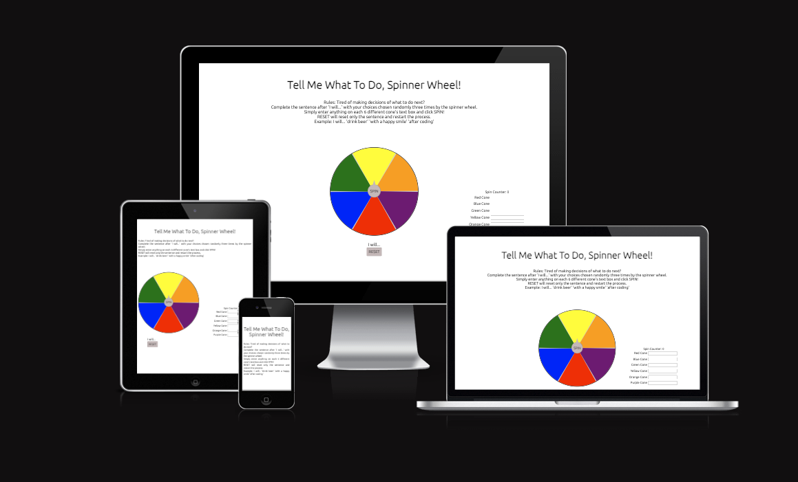
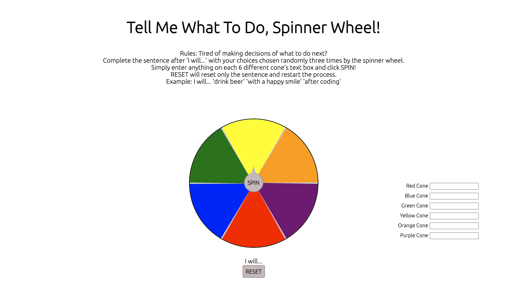
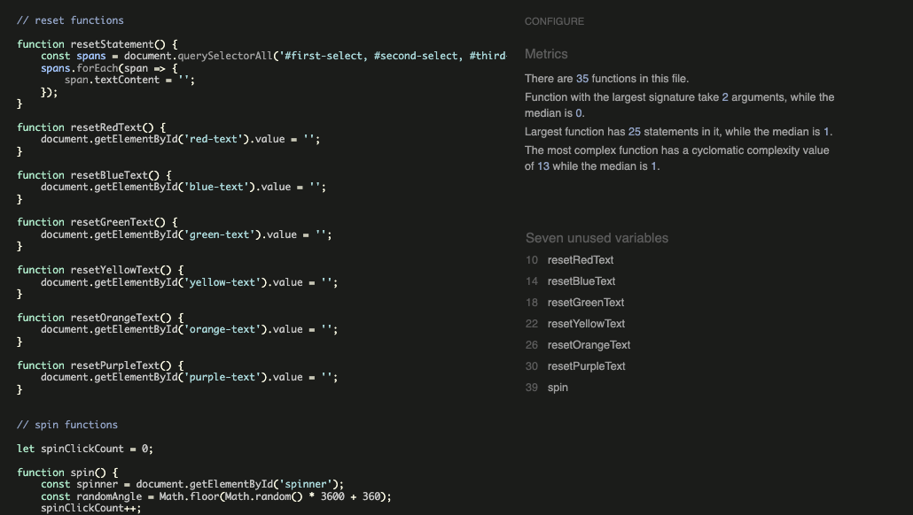
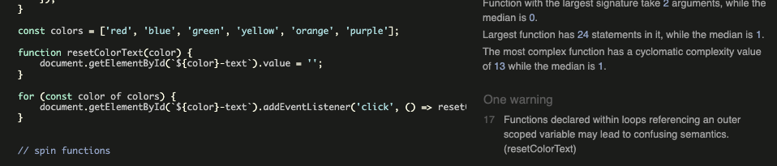
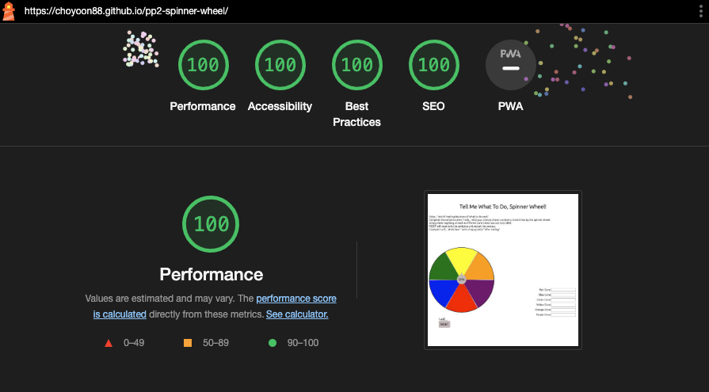
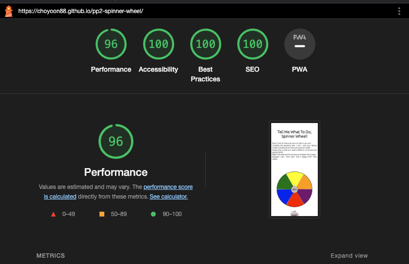

# Spinner Wheel



This is a spinner wheel that helps the user who is pondering or cannot decide what to do next. It could be used for entertainment purposes as well for letting someone do something later or not. The user can input 6 different options on each spinning cone, and can spin three times to create a statement. 

[Go to deployed page](https://choyoon88.github.io/pp2-spinner-wheel/)

# Feature


## Front Page


This is a very simple webpage. On the top, there is the rule of how the spinner wheel works. In the middle, there's the spinner wheel with a spin button on top of the spinner. 


## Text Input Areas
On the right-hand side or on the bottom of the spinner wheel for smaller screen sizes (width size less than 768px), we have 6 text input areas that link to each of the colour cones. The typed text on the input area will directly show up on the corresponding colour cone. 


## Spinner

When the user clicks 'spin', the spinner wheel will spin to a random number of angle for 3 seconds. The selected text depends on the angle of the cone, but for the users perspective the cone that the arrow touches will be selected. The text on the selected cone will automatically show up after the statement 'I will...'. 

User can create a sentence by clicking the spin three times and once the last spin is done, an alert message will show up with the finished statement. 


## Spin Counter

Spin counter will let the user know how many spins they have been done so far. The spin counter is set to 0 as default, and will increment to 1 once the user clicks the spin button. It will reset to 0 when the spin count reaches to 3 or the user presses the reset button. 


# Testing

## HTML
Conducted HTML validation check by [The W3C Markup Validation Service](https://validator.w3.org/)
- Line 22, 25, 28, 31, 34, 37 had unused `class="text"` on span. 
- Also, `span` was having `h5` as a child element which is not allowed. 
```
<div class="option" id="red">
    <span class="text"><h5></h5></span>
```
- Changed span to `div`, and h5 to `p`.
- Repositioned `class="text"` to be the class for `p`.
```
<div class="option" id="red">
    <div><p class="text"></p></div>
```

## CSS
Conducted CSS validation check by [The W3C Markup Validation Service](https://validator.w3.org/)
- No errors were spotted. 

## JavaScript
Conducted JavaScript check by [JSHint](https://jshint.com/)

- Seven unused variables were found. They initially were called by the onclick function on HTML.

    - Changed them to have event listener on JavaScript and solved the issue. 



- After simplifying the reset function, I got an a warning saying,

    >Functions declared within loops referencing an outer scoped variable may lead to confusing semantics. (resetColorText)
    - Changed the `for` loop to `forEach` and fixed the issue.




## Lighthouse

### Desktop



### Mobile


## Functional Testing

| Action | Expected Behavior    | Pass or Fail    |
| :---:   | :---: | :---: |
| Click 'SPIN' for the first time | - Spinner wheel should spin for 3 seconds <br> - Spin counter should be 1 from 0 <br> - Selected text should show up after the 'I will...' statement | P |
| Second 'SPIN' attempt | - Spinner wheel should spin for 3 seconds <br> - Spin counter should be 2 from 1 <br> - Selected text should show up after the first text on the statement section | P |
| Third 'SPIN' attempt | - Spinner wheel should spin for 3 seconds <br> - Spin counter should be 3 from 2 <br> - Selected text should show up after the second text on the statement section <br> - Popup alert message with the completed statement should show up | P |
| Close the popup alert message | - Spin counter should reset to 0 <br> - Statement should reset to 'I will...' <br> - Spinner wheel should set back to default degree (0 degree) | P |
| Red cone is overlapping with the arrow | - Text written on red cone input should be displayed on the statement | P |
| Blue cone is overlapping with the arrow | - Text written on blue cone input should be displayed on the statement | P |
| Green cone is overlapping with the arrow | - Text written on green cone input should be displayed on the statement | P |
| Yellow cone is overlapping with the arrow | - Text written on yellow cone input should be displayed on the statement | P |
| Orange cone is overlapping with the arrow | - Text written on orange cone input should be displayed on the statement | P |
| Purple cone is overlapping with the arrow | - Text written on purple cone input should be displayed on the statement | P |
| Click any input area while text is already written | - Previous text should be removed | P |
| Click 'RESET' | - Statement should reset back to 'I will...' <br> - Spin counter should reset back to 0 <br> - Spinner wheel should set back to default degree (0 degree) | P |


# Deployment

The site was deployed to GitHub pages. The steps to deploy are as follows:

1. In the GitHub repository, navigate to the Settings tab.
2. From the Code and automation menu, select the Pages.
3. From the Build and deployment section, selected the branch to have Main and /root, then hit save.
4. Once it is saved, the page will automatically be refreshed and on top of the Github Pages section, the deployed page could be found after 'Your site is live at.' 
5. [Deployed page](https://choyoon88.github.io/pp2-spinner-wheel/)

## Local Deployment

Local deployment could be done following the steps.

1. From my Gitpod repository, click '<>Code' right next to green 'Gitpod' icon.
2. Select 'local' and then HTTPS.
3. Copy the HTTPS address: https://github.com/choyoon88/pp2-spinner-wheel.git
4. Open terminal on the Mac computer.
5. Type git clone and paste the HTTPS address.
6. Install the git developer tools and download the command line in your computer.

# Credits

## Reference
- Coding main study [CodeInstitute](https://learn.codeinstitute.net/dashboard)
- Spin pointer created by [CSS clip path maker](https://bennettfeely.com/clippy/)
- Extra reading of CSS and JavaScript [W3schools](https://www.w3schools.com/)
- Extra reading of JavaScript [MDN Web Docs](https://developer.mozilla.org/en-US/docs/Web/JavaScript)
- Font by [Google Font](https://fonts.google.com/)
- MOV to GIF converter [cloudconvert](https://cloudconvert.com/mov-to-gif)